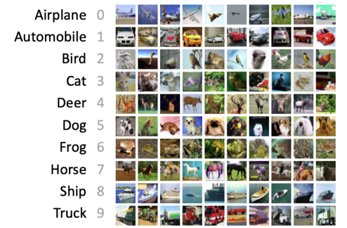
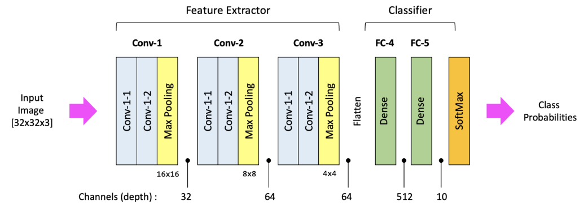
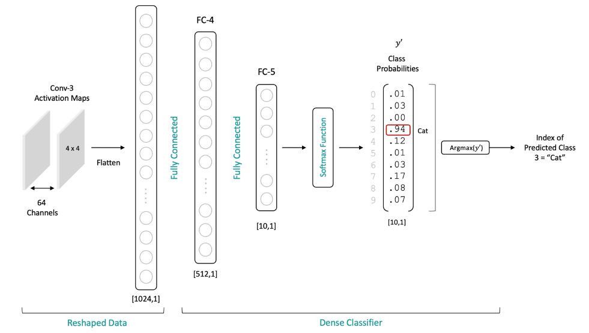
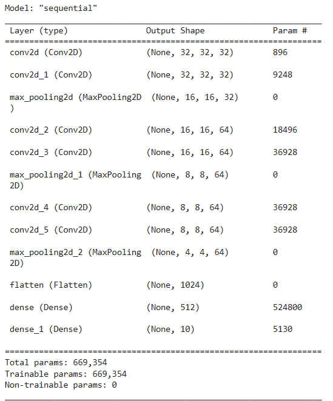
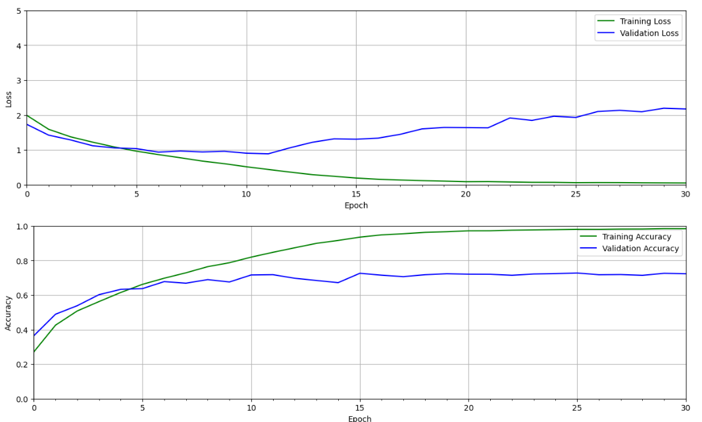
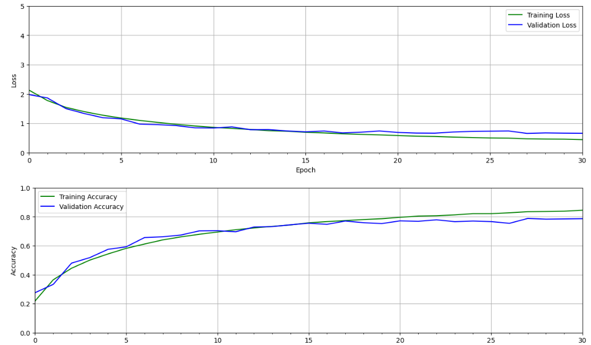
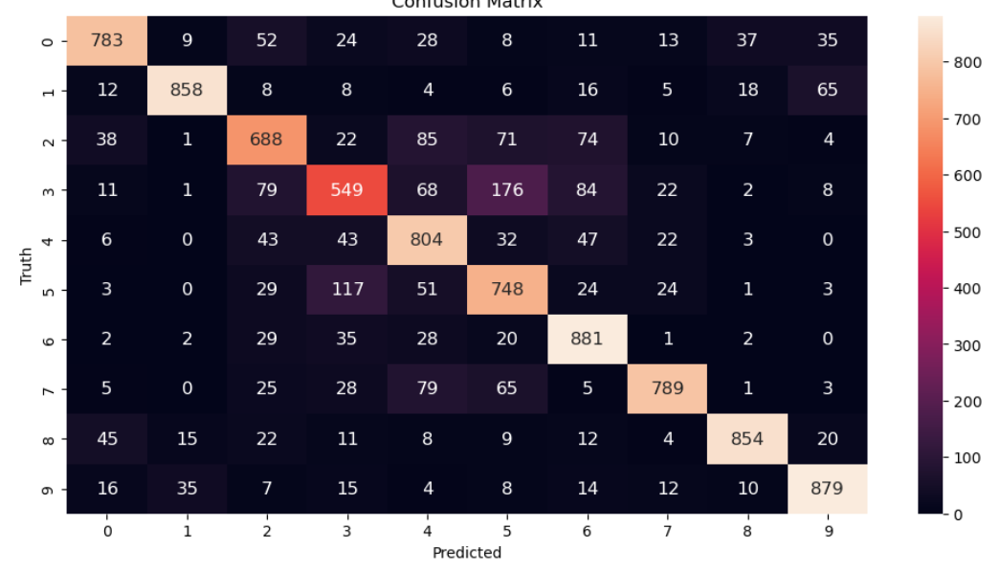

````Python
import random
from dataclasses import dataclass

import numpy as np
import tensorflow as tf
from matplotlib import pyplot as plt
from matplotlib.ticker import MultipleLocator, FormatStrFormatter
from tensorflow.keras.datasets import cifar10
from tensorflow.python.keras.layers import Conv2D,Dense,Dropout,MaxPooling2D,Flatten
from tensorflow.python.keras import Sequential
from tensorflow.python.keras.utils.np_utils import to_categorical

SEED_VALUE = 42
random.seed(SEED_VALUE)
np.random.seed(SEED_VALUE)
tf.random.set_seed(SEED_VALUE)

#get data and split in train and test
(X_train,Y_train),(X_test,Y_test) = cifar10.load_data()

#View Data
num_rows = 4
num_col = 8
#create figsize
plt.figure(figsize=(18,8))

#iterate data from view
for i in range(num_rows*num_col):
    ax = plt.subplot(num_rows,num_col,i+1)
    plt.imshow(X_train[i,:,:])
plt.show()

#normalize image
X_train = X_train.astype("float32")/255
X_test = X_test.astype("float32")/255


#Convert labels to one-hot encoding
Y_train = to_categorical(Y_train)
Y_test = to_categorical(Y_test)

@dataclass(frozen=True)
class DatasetConfig:
    NUM_CLASSES: int = 10
    IMG_WIDTH: int = 32
    IMG_HEIGHT: int = 32
    NUM_CHANNELS: int = 3

@dataclass(frozen=True)
class TrainingConfig:
    EPOCH: int = 31
    BATCH_SIZE: int = 256
    LEARNING_RATE: float = 0.001

def cnn_model(input_shape=(32,32,3)):
    #generate model type sequential
    model = Sequential()

    #Block #1 Convolutional
    model.add(Conv2D(filters=32,kernel_size=3,padding='same',activation='relu',input_shape=input_shape))
    model.add(Conv2D(filters=32,kernel_size=3,padding='same',activation='relu'))
    model.add(MaxPooling2D(pool_size=(2,2)))
    model.add(Dropout(0.3))

    #Block #2 Convolutional
    model.add(Conv2D(filters=64,kernel_size=3,padding='same',activation='relu'))
    model.add(Conv2D(filters=64,kernel_size=3,padding='same',activation='relu'))
    model.add(MaxPooling2D(pool_size=(2,2)))
    model.add(Dropout(0.3))

    #Block #3
    model.add(Conv2D(filters=64,kernel_size=3,padding='same',activation='relu'))
    model.add(Conv2D(filters=64,kernel_size=3,padding='same',activation='relu'))
    model.add(MaxPooling2D(pool_size=(2,2)))
    model.add(Dropout(0.3))

    #one dimensional array
    model.add(Flatten())
    model.add(Dense(512,activation='relu'))
    model.add(Dropout(0.5))
    model.add(Dense(10,activation='softmax'))

    return model

#init model
model = cnn_model()
#model summary
model.summary()

#compile model
model.compile(optimizer='rmsprop',
              loss='categorical_crossentropy',
              metrics=['accuracy'],)

#history and training
history = model.fit(X_train,
                    Y_train,
                    batch_size=TrainingConfig.BATCH_SIZE,
                    epochs=TrainingConfig.EPOCH,
                    verbose=1,
                    validation_split=0.3)


def plot_results(metrics,title=None,ylabel=None,ylim=None,metric_name=None,color=None):
    #create fig
    fig,ax = plt.subplots(figsize=(15,4))

    if not (isinstance(metric_name,list) or isinstance(metric_name,tuple)):
        metrics = [metrics,]
        metric_name = [metric_name]

    for idx,metric in enumerate(metrics):
        ax.plot(metric,color=color[idx])

    plt.xlabel('Epoch')
    plt.ylabel(ylabel)
    plt.title(title)
    plt.xlim((0,TrainingConfig.EPOCH-1))
    plt.ylim()
    #Tailor x-axis tick marks
    ax.xaxis.set_major_locator(MultipleLocator(5))
    ax.xaxis.set_major_formatter(FormatStrFormatter('%d'))
    ax.xaxis.set_minor_locator(MultipleLocator(1))
    plt.grid(True)
    plt.legend(metric_name)
    plt.show()
    plt.close()


train_loss = history.history['loss']
train_acc = history.history['accuracy']
valid_loss = history.history['val_loss']
valid_acc = history.history['val_accuracy']

plot_results([train_loss,valid_loss],
             ylabel = 'Loss',
             ylim=[0.0,5.0],
             metric_name=['Training Loss','Validation Loss'],
             color=['g','b'])
plot_results([train_acc,valid_acc],
             ylabel='Accuracy',
             ylim=[0.0,1.0],
             metric_name=['Training Accuracy','Validation Accuracy'],
             color=['g','b'])


model.save("model/modelcnn.h5")

def evualuate_model(dataset,model):
    class_names = ['airplane',
                   'automobile',
                   'bird',
                   'cat',
                   'deer',
                   'dog',
                   'frog',
                   'horse',
                   'ship',
                   'truck']

    num_rows = 3
    num_col = 6

    #retrieve a number of images from the dataset
    data_batch = dataset[0:num_col*num_rows]

    #get prediction model
    predictions = model.predict(data_batch)

    #figure
    plt.figure(figsize=(20,8))
    num_matches = 0

    for idx, in range(num_rows*num_col):
        ax = plt.subplot(num_rows,num_col,idx+1)
        plt.axis("off")
        plt.imshow(data_batch[idx])

        pred_idx = tf.argmax(predictions[idx]).numpy()
        truth_idx = np.nonzero(Y_test[idx])

        title = str(class_names[truth_idx[0][0]]+ " : "+str(class_names[pred_idx]))
        title_obj = plt.title(title,fontdict={'fontsize':13})
        if pred_idx == truth_idx:
            num_matches +=1
            plt.setp(title_obj,color='g')
        else:
            plt.setp(title_obj,color='r')
        acc = num_matches/(idx+1)
        print("Prediction Accuracy",int(100*acc)/100)
        return


evualuate_model(X_test,model)


#generate prediction dataset
predictions = model.predict(X_test)
#for each sample image in the test dataset
predict_labels = [np.argmax(i) for i in predictions]

#convert one-hot encoded labels to integer
y_test_integer_labels = tf.argmax(Y_test,axis=1)
#generate matrix confution for the test dataset
cm = tf.math.confusion_matrix(labels=y_test_integer_labels,predictions=predict_labels)
#plot the confusion matriz as  a heatmap
plt.figure(figsize=(12,6))
import seaborn as sb
sb.heatmap(cm,annot=True,fmt='d',annot_kws={'size:':12})
plt.title('Confusion matrix')
plt.xlabel('Predicted')
plt.ylabel('Truth')
plt.show()


````

 







No Dropout.


With Dropout


Confusion Matrix.


